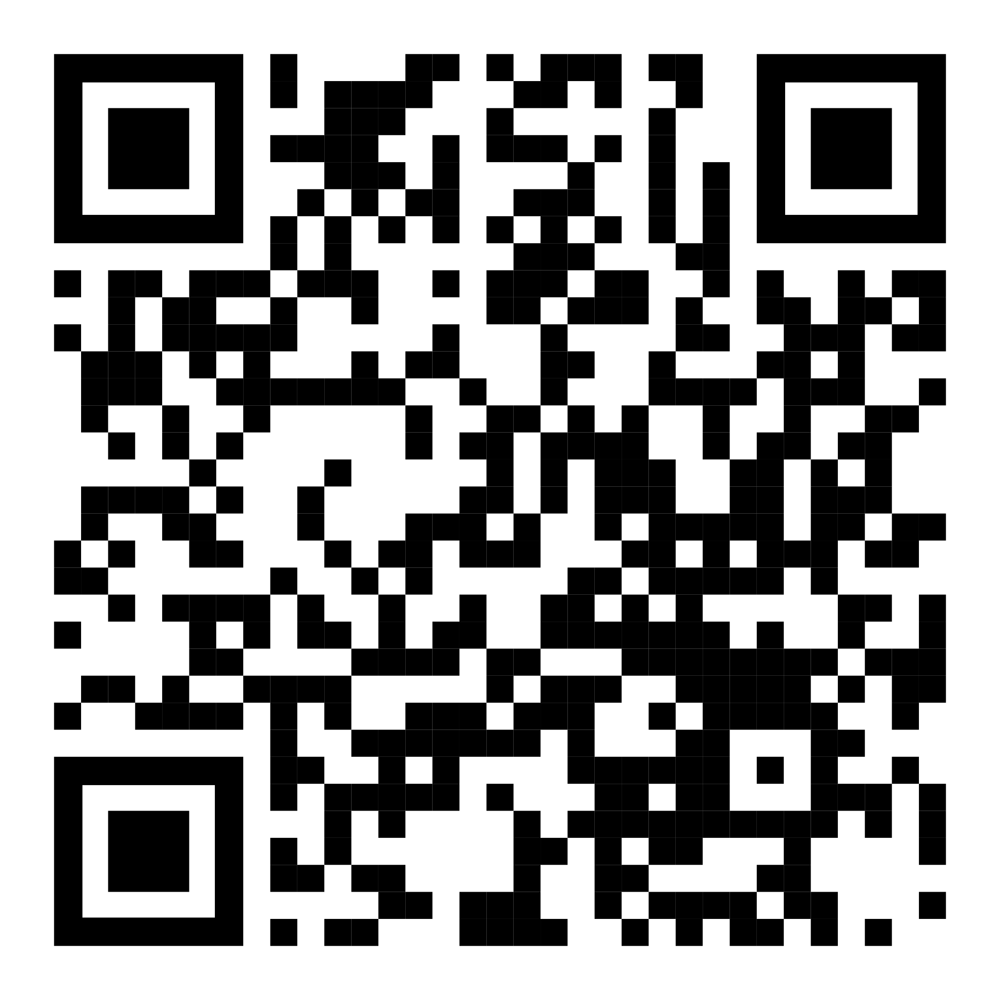

# Prenotazione

Per prenotarsi all'esperimento potete andare nel [**Colab Booking System**](http://colab.psy.unipd.it/booking-system/), iscrivervi e poi selezionare tra gli esperimenti disponibili **VWM Consciousness Behavioral**. Ci saranno diversi slot disponibili e potete scegliere quello che preferite.

Qui trovate un tutorial per iscrivervi e prenotarvi:

<iframe src="https://docs.google.com/presentation/d/e/2PACX-1vQfwb9VVbMW4PTRELFPOl5sXhJ0qAdzn-7CsaqrxJ3c1vHWhuYej2poyXk7j7_eEa3xpogVd0IRsLXP/embed?start=false&loop=true&delayms=60000" frameborder="0" width="960" height="749" allowfullscreen="true" mozallowfullscreen="true" webkitallowfullscreen="true"></iframe>

# Contatti

Per qualsiasi dubbio/curiosità/domanda potete scrivermi a [filippo.gambarota@phd.unipd.it](mailto:filippo.gambarota@phd.unipd.it)

# QR CODE

Questo QR-CODE riporta sempre su questo sito:

